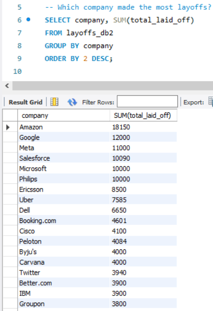
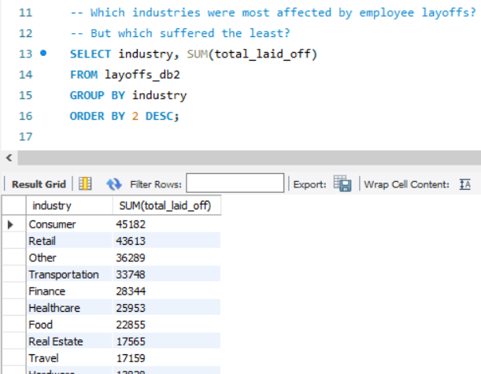
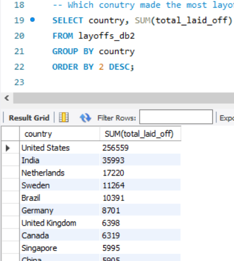
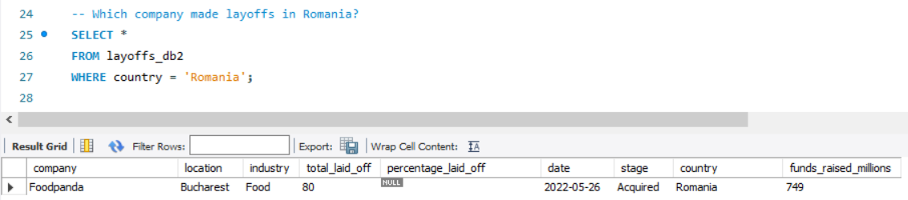
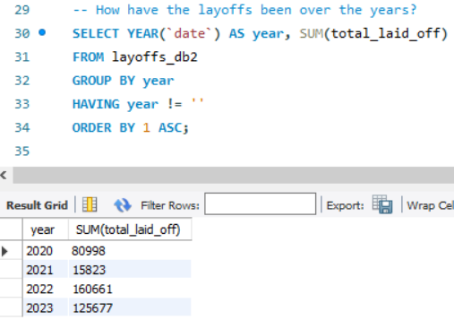
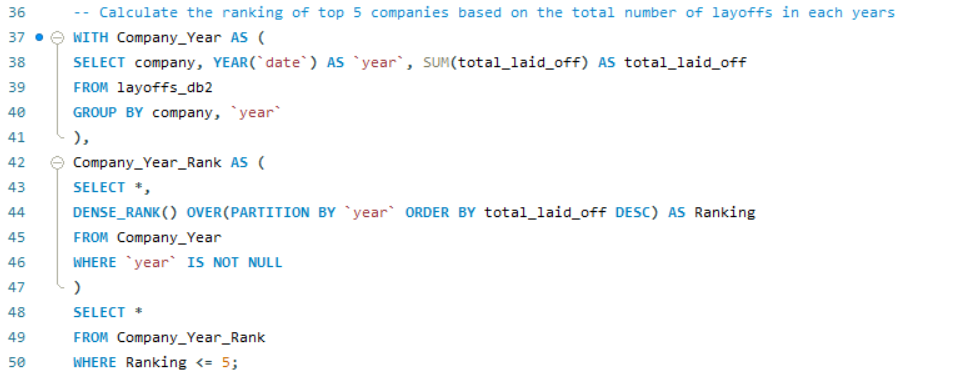
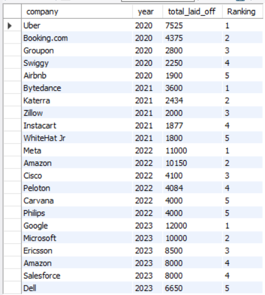

<h1 align="center">MySQL_Layoffs_Database</h1>
<h3>Case Study: Analysis of Layoff Trends</h3>
    <h4>Objective</h4>
    
The analysis aims to understand the trends and patterns in employee layoffs using the layoffs_db2 dataset cleaned from https://github.com/alexandradanca/MySQL_Layoffs_Data_Cleaning.
 
    
We will evaluate the time frame of data collection, identify companies, industries, and countries most impacted by layoffs, and explore year-on-year trends.

<h3>Case Study Queries and Outputs</h3>
    <ol>
      <b><li>What date range was this database created for?</li></b>
      
      
<b>Interpretation: </b>The database covers layoffs between March 11, 2020, and March 6, 2023, encompassing the COVID-19 pandemic and its aftermath.

      <b><li>Which company made the most layoffs?</li></b>
      
      
<b>Interpretation: </b>Amazon had the highest layoffs with 18,150 employees, followed by Google with 12,000 employees.

      <b><li>Which industries were most affected by employee layoffs? Which suffered the least?</li></b>
      
      
<b>Interpretation: </b>Industries such as Consumer, Retail, and Transportation were most impacted, while Manufacturing, Fin-Tech, and Aerospace suffered the least.

      <b><li>Which country made the most layoffs?</li></b>
      
      
<b>Interpretation: </b>The United States led in layoffs, followed by India and the Netherlands.

      <b><li>Which company made layoffs in Romania?</li></b>
      
      
<b>Interpretation: </b>Foodpanda is the only recorded company making layoffs in Romania.

      <b><li>How have layoffs been distributed over the years?</li></b>
      
      
<b>Interpretation: </b>Layoffs spiked in 2022 with 160,661 employees laid off, likely reflecting post-pandemic restructuring. A decline is observed in 2023 but remains significant.

      <b><li>Ranking top 5 companies based on layoffs in each year</li></b>
      
      
      
<b>Interpretation: </b>Amazon consistently ranks highest in layoffs in multiple years.

    </ol>
    <h3>Conclusion</h3>
    
This analysis highlights critical layoff trends between 2020 and 2023. Amazon and the United States stand out as the most impacted company and country, respectively, while layoffs peaked in 2022. 
      The Consumer and Retail industries bore the brunt, and Romania witnessed layoffs from Foodpanda.

